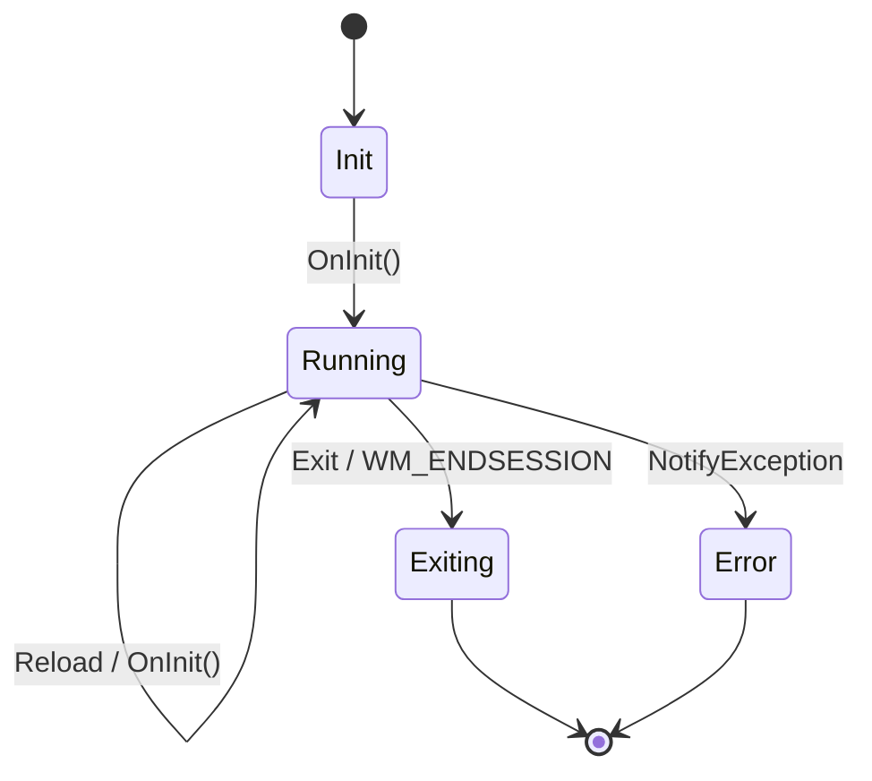
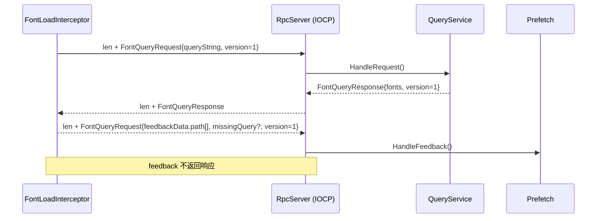

# SubtitleFontAutoLoaderDaemon 技术文档

## 1. 目标与运行时架构

`SubtitleFontAutoLoaderDaemon` 是常驻后台的托盘程序：读取配置与字体索引，监控目标进程创建并触发注入；同时对注入 DLL 提供本地 RPC 查询服务，并接收字体加载反馈用于预取。

核心模块分工（对应源码文件）：

- **生命周期/编排**：`SubtitleFontAutoLoaderDaemon/Main.cpp`
- **托盘与菜单**：`SubtitleFontAutoLoaderDaemon/TrayIcon.*`
- **进程监控/注入触发**：`SubtitleFontAutoLoaderDaemon/ProcessMonitor.*`
- **RPC 服务器**（Named Pipe + IOCP）：`SubtitleFontAutoLoaderDaemon/RpcServer.*`
- **索引查询**（Trie + 匹配规则）：`SubtitleFontAutoLoaderDaemon/QueryService.*`
- **预取**（LRU + feedback handler）：`SubtitleFontAutoLoaderDaemon/Prefetch.*`
- **ETW 日志**：接口在 `SharedIncludes/EventLog.h`，实现位于 `Generated/EventLog.cpp`（运行时依赖 `Generated64.dll/Generated32.dll`）

```mermaid
flowchart LR
  subgraph Daemon[SubtitleFontAutoLoaderDaemon.exe]
    CFG[ConfigFile::ReadFromFile]
    QS[QueryService<br/>Trie 索引]
    RPC[RpcServer<br/>Named Pipe + IOCP]
    PM[ProcessMonitor<br/>WMI 进程创建事件]
    PF[Prefetch<br/>LRU + feedback]
    TRAY[SystemTray<br/>Reload/Exit]
  end

  XML[FontIndex.xml] --> QS
  CFG --> QS
  CFG --> PM
  QS --> RPC
  PF --> RPC
  PM --> INJ[CreateProcess: rundll32 + InjectProcess]
  INJ --> DLL[FontLoadInterceptor32/64.dll]
  DLL <--> RPC
  DLL -->|feedbackData.path[]| PF
```

## 2. 运行时文件与配置

默认约定：daemon 从 **exe 同目录**读取配置 `SubtitleFontHelper.toml`，并在同目录读写 `lruCache.txt`。当前 TOML 读取实现支持本项目所需的简单子集：正整数、字符串、字符串数组，以及 `[notifications]` 和 `[[index_files]]` 表。

典型运行目录（按 `copyFiles.ps1` 的打包方式）包含：

- `SubtitleFontAutoLoaderDaemon.exe`
- `FontLoadInterceptor32.dll`、`FontLoadInterceptor64.dll`
- `Generated32.dll`、`Generated64.dll`（ETW/EventLog 依赖）
- `SubtitleFontHelper.toml`（配置）
- `*.state.bin`（managed index 快照；与对应索引文件同目录）
- `event.man`、`registerETW.ps1`、`unregisterETW.ps1`（可选：用于注册 ETW 清单）

配置文件关键字段（示例）：

```toml
wmi_poll_interval = 1000
lru_size = 100
monitor_processes = ["mpc-hc64.exe", "mpc-hc.exe"]

[notifications]
managed_index_notifications = true
managed_index_failure_notifications = false
missing_font_notifications = false

[[index_files]]
path = 'indexes/FontIndex.xml'
source_folders = ['fonts']
```

- `index_files[].path`：字体索引 XML 路径（可多条）。
- `source_folders[]`：托管索引对应的字体目录；配置后会首建索引，并通过 watcher 维护增量同步。
- TOML 里的 `index_files[].path` 与 `source_folders[]` 支持相对路径，基准目录是 `SubtitleFontHelper.toml` 所在目录（通常也是 exe 目录）；绝对路径仍可用。
- 索引 XML 内的 `FontFace/@path` 支持相对路径，基准目录是该 XML 文件所在目录；daemon 读取后统一解析为绝对路径。
- managed index 的 `.state.bin` 快照在可行时会写成相对快照文件目录的路径；当前写出版本为 v2，读取仍兼容 v1。
- `monitor_processes`：要监控的进程“路径或进程名”。实现上是**后缀匹配**（忽略大小写）并要求边界为路径起点或分隔符。
- `wmi_poll_interval`：WMI 轮询间隔（毫秒）。越小越及时，但 WMI/CPU 压力越大。
- `lru_size`：预取 LRU 容量（条目数）。
- `[notifications]`：集中定义所有系统通知相关开关。
- `[notifications].managed_index_notifications`：统一控制托管索引的系统通知。默认关闭；开启后会提示索引建立开始、建立完成、更新完成。
- `[notifications].managed_index_failure_notifications`：单独控制索引失败通知。默认关闭；包括索引建立失败和更新失败。
- `[notifications].missing_font_notifications`：缺失字体系统通知开关。默认关闭；仅当索引查询无结果且系统字体也不存在时才提示。
- daemon 只读取 `SubtitleFontHelper.toml`。

## 3. 启动与生命周期（Main.cpp）

### 3.1 单实例

`SingleInstanceLock` 使用命名 mutex：`SubtitleFontAutoLoaderMutex-<UserSid>`。同一用户会话下只允许一个实例；不同用户互不影响。

### 3.2 消息驱动的主循环

主线程运行 `DaemonMain()`，通过队列处理四类消息：

- `Init`：启动/重载初始化（`OnInit()`）
- `Reload`：重新读取配置、重建服务对象（`OnInit()`）
- `Exit`：正常退出
- `Exception`：收到子线程异常后在主线程 rethrow，最终由 `wWinMain` 捕获并弹框退出



### 3.3 调试开关与 detour 规避

- `-debug`：设置 `g_debugOutputEnabled=true`，在 `QueryService::Load()` 时把三棵 trie dump 到 exe 目录（`*.trie.txt`）。
- 进程启动时设置环境变量 `__NO_DETOUR=TRUE`。注入 DLL（`FontLoadInterceptor`）内部会读取该变量并跳过 detour 逻辑；同时它也会对进程名 `rundll32.exe` 做硬过滤，避免注入辅助进程被再次拦截。

## 4. 托盘图标与用户交互（TrayIcon）

托盘实现运行在独立线程：

- 创建隐藏窗口，注册菜单资源 `IDR_TRAYMENU`，并进入消息循环。
- 启动初期显示 “Loading” 图标与提示；`OnInit()` 完成后调用 `SystemTray::NotifyFinishLoad()` 切换到常规图标。
- 右键菜单提供 `Reload` 与 `Exit`：
  - `Reload` → `IDaemon::NotifyReload()` → 主线程 `OnInit()` 重建服务
  - `Exit` → `IDaemon::NotifyExit()` → 主线程退出
- `WM_ENDSESSION`（注销/关机）会触发退出。

## 5. 进程监控（ProcessMonitor：WMI 异步事件）

### 5.1 订阅模型

`ProcessMonitor` 在工作线程中完成 COM/WMI 初始化，并通过异步通知订阅进程创建事件：

- 查询模板：`SELECT * FROM __InstanceCreationEvent WITHIN <sec> WHERE TargetInstance ISA 'Win32_Process'`
- 事件回调 `IWbemObjectSink::Indicate()` 只负责入队（轻量），实际处理在同一工作线程的消费循环中完成。

### 5.2 过滤规则（决定是否注入）

对每个进程创建事件：

1) 读取 `ExecutablePath`（为空则直接忽略）。
2) **后缀匹配** `monitor_processes` 列表（忽略大小写，且匹配边界必须是路径起点或 `\\`/`/`）。
3) 若命中，进一步调用 WMI 方法 `GetOwnerSid`，要求目标进程 Owner SID 与 daemon 当前用户 SID 完全一致（避免跨用户误注入）。
4) 通过 `IsWow64Process2` 判断目标进程位宽，选择 32/64 位 interceptor DLL，进入注入流程。

安全保护：`SetMonitorList()` 明确禁止配置 `rundll32.exe`，否则直接抛异常（避免递归/灾难性后果）。

## 6. 注入流程（rundll32 + InjectProcess）

daemon 本身不直接执行远程线程注入，而是通过 `CreateProcessW()` 启动：

```text
rundll32.exe "<exe目录>\FontLoadInterceptor{32|64}.dll",InjectProcess <pid>
```

其中 `FontLoadInterceptor` 导出函数 `InjectProcess`（`FontLoadInterceptor/dllmain.cpp`）完成真正的注入：

- `OpenProcess(PROCESS_CREATE_THREAD | PROCESS_VM_OPERATION | PROCESS_VM_WRITE | PROCESS_VM_READ, ...)`
- `VirtualAllocEx` 在目标进程写入 DLL 自身路径
- `CreateRemoteThread` 以 `LoadLibraryW` 为入口把 interceptor DLL 加载到目标进程
- 成功/失败通过 ETW 记录（`LogDllInjectProcessSuccess/Failure`）

位宽注意事项：实现上依赖 `rundll32.exe` 作为“同位宽宿主”来加载对应 DLL。若在 x64 环境下对 x86 目标注入失败，优先排查实际启动的 `rundll32` 位宽是否与 `FontLoadInterceptor32.dll` 匹配（当前命令行未显式指定 `System32/SysWOW64` 路径）。

## 7. RPC：Named Pipe + IOCP（RpcServer）

### 7.1 命名与隔离

Named Pipe 名称为：`\\.\pipe\SubtitleFontAutoLoaderRpc-<UserSid>`，使不同用户会话天然隔离；并设置 `PIPE_REJECT_REMOTE_CLIENTS` 拒绝远程客户端。

### 7.2 线协议（framing + Protobuf）

传输为 **字节流**（`PIPE_TYPE_BYTE`），自行做 framing：

- `uint32 length`（小端）+ `length` 字节的 Protobuf payload
- 单条消息长度上限 4MiB（超过直接断开连接）

消息类型来自 `SharedIncludes/FontQuery.proto`：

- `FontQueryRequest { version=1, queryString=... }` → 服务端返回 `FontQueryResponse`
- `FontQueryRequest { version=1, feedbackData { path[], missingQuery? } }` → 单向消息（**无响应**）

### 7.3 并发架构

- 1 个 listener 线程负责 `ConnectNamedPipe`（overlapped）。
- IO 通过 IOCP 分发到 worker 线程池（数量按 CPU 核心数取值，上限 8）。
- 每条连接维护一个状态机：读长度 → 读消息 → 处理 →（可选）写响应 → 回到读长度。



## 8. 查询服务（QueryService：Trie + 匹配规则）

### 8.1 数据结构：压缩 Trie（QueryTrie）

`QueryService` 使用三棵 Trie 存放不同 name 类型到 `FontFaceElement*` 的映射：

- `Win32FamilyName`：允许重复 key，支持“截断匹配”
- `FullName`、`PostScriptName`：不允许重复 key

Trie 的边是“字符串片段”（压缩 trie），每个节点的分支按首字符排序并二分查找，降低查询开销。

### 8.2 加载与版本号（SHM）

`Load(std::vector<std::unique_ptr<FontDatabase>>&&)` 会：

1) 遍历所有索引库的 `FontFaceElement`，按 `NameElement::m_type` 分发到对应 trie。
2) 若开启 `-debug`，dump trie 到 exe 同目录：`win32FamilyName.trie.txt` / `fullName.trie.txt` / `postScriptName.trie.txt`。
3) 用互斥锁替换内部 `m_dbs` 与 trie（`m_dbs` 需要长期持有以保证 trie 内指针有效）。
4) 通过共享内存 `SubtitleFontAutoLoaderSHM-<UserSid>` 的 32-bit 计数器 bump version（`InterlockedIncrement`）。

该 version 用于注入 DLL 侧的查询缓存失效（见 `FontLoadInterceptor/RpcClient.cpp::QueryCache`）。

### 8.3 查询逻辑（HandleRequest）

处理顺序与规则（关键点）：

- `queryString` 由 UTF-8 转成 `wstring`。
- 若 `queryString.size()==31`，启用 truncated 模式（兼容 GDI `LOGFONT::lfFaceName` 的 31 wchar_t 限制）：
  - 对 `Win32FamilyName`：允许“前缀命中”返回整棵子树数据。
- 查询优先级：
  1) 若 `Win32FamilyName` 有结果：直接返回该列表。
  2) 否则查询 `PostScriptName` 与 `FullName`，并按 `psOutline` 分流：
     - PostScript 通道：过滤掉 `psOutline != 1`
     - FullName 通道：过滤掉 `psOutline == 1`
- 最终按 `(path,index)` 去重后填充响应（重复字段为 `familyName/gdiFullName/postScriptName`）。

## 9. 预取与反馈（Prefetch）

`Prefetch` 实现 `IRpcFeedbackHandler`：

- 反馈内容为 `feedbackData.path[]`（UTF-8），收到后转 `wstring`。
- 通过固定容量 LRU（`SimpleLRU<std::wstring>`）维护“最近加载过的字体路径”。
- **仅当新条目进入 LRU** 时调用：
  - `AddFontResourceExW(path, FR_PRIVATE | FR_NOT_ENUM, ...)`
  - 以触发字体文件读取（典型用途是预取/热缓存），不对系统全局字体集合做污染。

缓存文件：`lruCache.txt`（UTF-8 文本，每行一个路径）。

- 启动：逐行读取并加载，恢复 LRU 顺序。
- 退出：把 LRU 快照写回文件（按“旧 → 新”写出，便于下次恢复）。

## 10. 日志与可观测性（ETW/EventLog）

日志通过 ETW provider `SubtitleFontHelper` 输出（`Generated/EventLog.cpp` 负责注册/注销 provider）：

- daemon 侧：`QueryService` 在 bump version 时记录 `LogDaemonBumpVersion`。
- interceptor 侧：注入成功/失败、detour attach、查询命中/失败、实际加载字体等事件也会写入 ETW。

注册清单（可选但推荐用于可视化）：

- `registerETW.ps1`：管理员权限下注册 `event.man`，并把 resource/message 文件指向 `Generated64.dll`。
- `unregisterETW.ps1`：反注册清单（搬移/更新程序前建议先执行）。

查看位置：Windows 事件查看器 → “应用程序和服务日志 - SubtitleFontHelper”（与 `README.md` 描述一致）。

## 11. 本地烟测与排障清单

最小验证路径（建议在 `ReleaseBuild/` 目录下执行）：

1) 使用 `FontDatabaseBuilder.exe` 生成 `FontIndex.xml`。
2) 配置 `SubtitleFontHelper.toml`。至少包含一个索引文件项和一个监控进程项。
3) 启动 `SubtitleFontAutoLoaderDaemon.exe`，确认托盘出现并从 Loading 切换为正常状态。
4) 启动被监控的 Win32 程序，观察：
   - 是否触发注入（可通过 ETW 事件或进程模块列表验证）
   - 查询/加载是否产生预期效果（字幕字体是否自动生效）

常见问题排查：

- **WMI 无事件/延迟大**：调大 `wmi_poll_interval` 可降压但更慢；某些进程 `ExecutablePath` 可能为空会被忽略。
- **注入失败**：检查目标进程权限/Owner SID 是否一致；确认 `FontLoadInterceptor32/64.dll` 与 `Generated32/64.dll` 均在 exe 目录；关注位宽与 `rundll32` 匹配问题。
- **RPC 连接失败**：Named Pipe 名称包含 `<UserSid>`，跨用户会话不互通；协议要求 `version==1` 且长度不超过 4MiB。
- **Reload 后行为异常**：Reload 会销毁并重建服务对象；若有第三方进程长期持有 pipe 连接，可能会经历断连重连。
